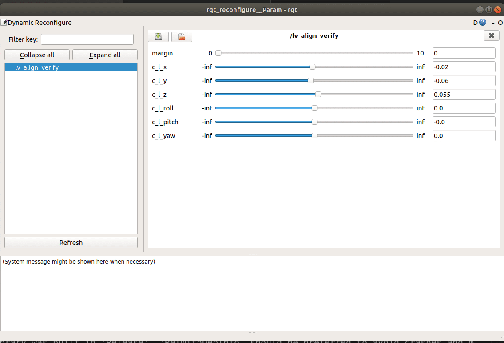

# 程序说明
该程序用于测试激光雷达和相机的外参是否准确。在config中可以给定外参，在opencv的画面中，将会实时地出现激光点云在相机FOV中的投影点，根据图像中环境的几何一致性，用户可以对外参的精度有一个定性的了解。用户还通过Dynamic reconfiguraton功能实时改变外参，以便微调外参。

具体的参数配置及其含义见于config/params.yaml，验证过程中的每一帧图像都会保存至image下

传感器型号：RS-LiDAR-16，ZED2

## 依赖
测试系统为：Ubuntu18.04 ，ROS版本为Melodic，显卡为GTX 950M，i5-4200H
### 主依赖
opencv 3.4.11(主要是为了和CUDA兼容，实际上只要是opencv3,应该都可以)
opencv contrib 3.4.11（版本必须与opencv保持一致）
zed sdk
[rslidar_sdk](https://github.com/RoboSense-LiDAR/rslidar_sdk)
Ceres
GLOG
### 副依赖
CUDA 10.2（由显卡以及ZED sdk决定）

# 使用说明
## 运行
```
roslaunch lv_align_verify lv_align_verify.launch
```
## 动态调参
```
rosrun rqt_reconfiguration rqt_reconfiguration
```

## 界面展示
### 可视化界面

### 动态调参界面


# 补充说明
1. 整个程序pose的定义规则：transform_c_l表示lidar在camera中的pose
2. 动态调参中的r q y为常见的欧拉角定义，即代表以ZYX顺序进行内旋。
3. 外参输入说明：从其他标定程序得到齐次外参矩阵，将其填入yaml的`transform_c_l`即可，程序启动后会提示对应的`x,y,z,roll,pitch,yaw`，并且自动修改dynamic reconfigure里的参数。
4. 建议修改`params.yaml`中的`output_directory`参数，确保路径无需sudo权限（无需手动创建路径，程序会根据该项自动创建）
4. 在画面中，按下方按键会执行相应指令
* q : 关闭程序
* s : 保存当前帧
5. 画面中的点云颜色与反射强度直接相关，随着反射强度的增加，颜色经历以下变换:红色->绿色->蓝色。
6. 程序退出时，会打印最终的变换矩阵。

# 修改日志
1. 2021-09-11 实现外参的可视化验证功能
2. 2021-09-22 修复初始化参数会被动态调参模块的配置文件默认值覆盖的bug；更新了延迟说明

# TODO
[x]激光点的投影和图像存在明显的延迟
* 9/22得到了ZED support的回复，相机的时间戳也是system clock，但是USB传输本身有缓冲区，这个时间戳是图片信息
出现在缓冲区里的时刻。程序里会出现相机在激光到达后开始采集，时间戳却反而更早的情况是正常现象，并非bug。USB传输的缓冲区
所带来的延迟取决于带宽和总线速度，软件上不可控。
目前的带宽下（720P，60FPS，无其他USB设备工作）时间戳顺序为：

`image_zed.timestamp` < `lidar_msgs.header.timestamp` < `pointCallback.begintime` < `call grab`

以image_zed为基准，后续的dt分别为：0.026s, 0.0296s, 0.300s，说明该方式下，激光约滞后于相机1.5帧。
更为合理的同步方案是根据image时间戳和msg时间戳进行匹配，因为他们都最接近于实际数据的到达时刻（略滞后于采集时刻，因为zed与rslidar均不带有RTC）

[ ]代码清理

[ ]IMU运动畸变校正
